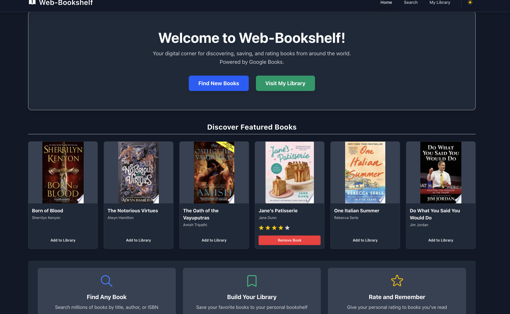
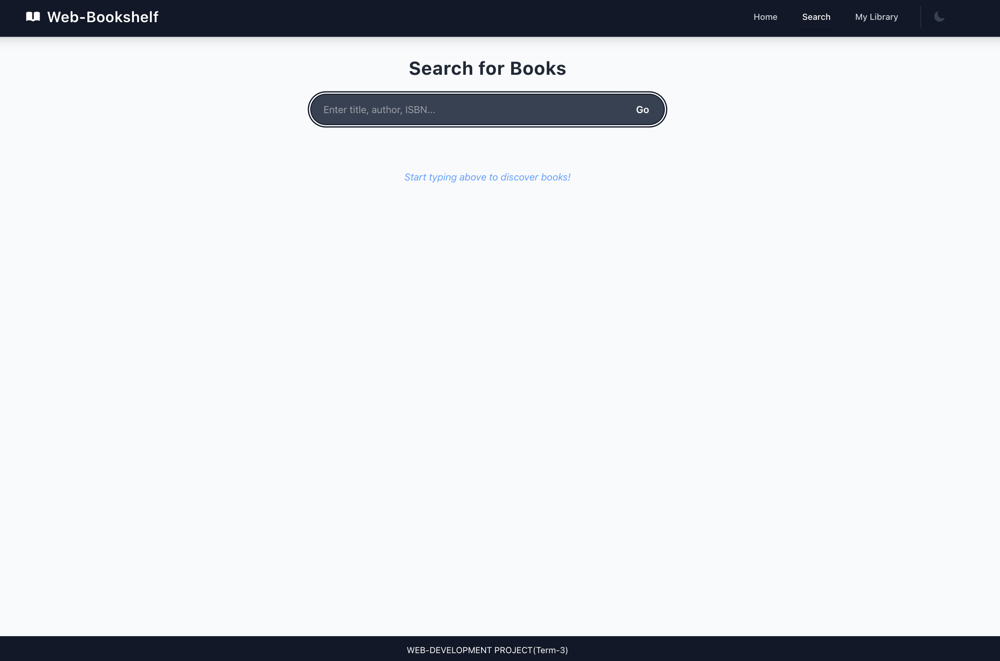
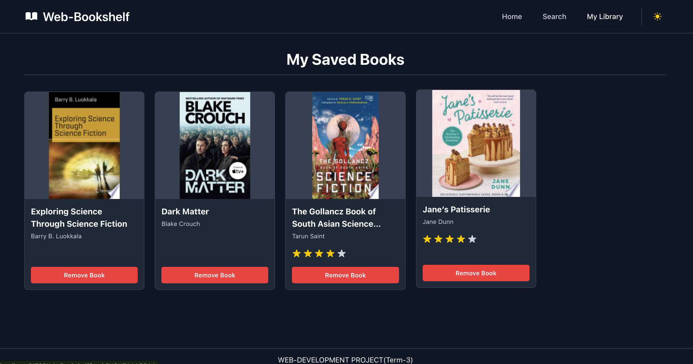

# Web-Bookshelf

## Description
Web-Bookshelf is a digital book collection manager that allows users to discover, save, and rate books from around the world. Powered by the Google Books API, it enables users to search for books by title, author, or ISBN, add them to their personal library, and maintain a curated collection of favorite reads.

## Features
- **Book Search**: Search millions of books using the Google Books API
- **Book Details**: View comprehensive details for each book including cover art, author information, publishing details, and descriptions
- **Personal Library**: Save favorite books to a personal digital bookshelf
- **Rating System**: Rate books on a five-star scale to remember how much you enjoyed them
- **Responsive Design**: Works seamlessly on desktop, tablet, and mobile devices
- **Dark/Light Mode**: Toggle between dark and light themes for comfortable reading in any environment
- **Persistent Storage**: Library data and ratings are saved in local storage so they persist between sessions

## Tech Stack
- **React**: Frontend UI library for building the user interface
- **React Router**: For navigation and routing between pages
- **Tailwind CSS**: For styling and responsive design
- **Google Books API**: External data source for book information
- **Local Storage API**: For persisting user preferences and library data
- **Vite**: Build tool and development server
- **Axios**: For making HTTP requests to the Google Books API

## Setup Instructions
1. **Clone the repository**
   ```
   git clone https://github.com/heavycoderyash/Web-Bookshelf.git
   cd Web-Bookshelf
   ```

2. **Install dependencies**
   ```
   npm install
   ```

3. **Run the development server**
   ```
   npm run dev
   ```

4. **Build for production**
   ```
   npm run build
   ```

5. **Preview the production build**
   ```
   npm run preview
   ```

## Project Structure
```
Web-Bookshelf/
├── public/               # Static assets
├── src/                  # Source files
│   ├── api/              # API integration
│   │   └── googleBooks.js   # Google Books API functions
│   ├── components/       # Reusable UI components
│   │   ├── BookCard.jsx     # Book card component
│   │   ├── Footer.jsx       # Footer component
│   │   ├── Navbar.jsx       # Navigation bar component
│   │   ├── Rating.jsx       # Star rating component
│   │   └── ThemeToggle.jsx  # Dark/light mode toggle
│   ├── context/          # React context providers
│   │   ├── BookContext.jsx  # Book data management context
│   │   └── ThemeContext.jsx # Theme management context
│   ├── pages/            # Page components
│   │   ├── BookDetails.jsx  # Book details page
│   │   ├── Home.jsx         # Home page
│   │   ├── MyLibrary.jsx    # User library page
│   │   └── Search.jsx       # Book search page
│   ├── screenshots/      # Project screenshots
│   ├── App.jsx           # Main application component
│   ├── index.css         # Global styles
│   └── main.jsx          # Application entry point
├── eslint.config.js      # ESLint configuration
├── package.json          # Dependencies and scripts
├── vite.config.js        # Vite configuration
├── index.html            # HTML entry point
└── README.md             # Project documentation
```

## Screenshots
### Home Page

*The home page showcases featured books and provides navigation to other sections of the app.*

### Search Results

*Users can search for books and view the results in a clean, grid layout.*

### Book Details

*Detailed view of a book with comprehensive information and options to add to library or rate.*

### My Library

*The user's personal collection of saved books for easy access.*

### Library Home

*Light mode view of the library homepage with saved books.*
